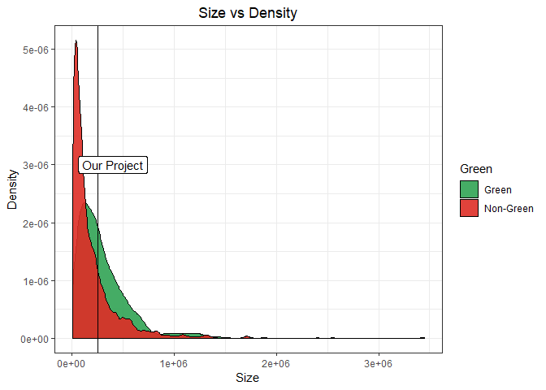
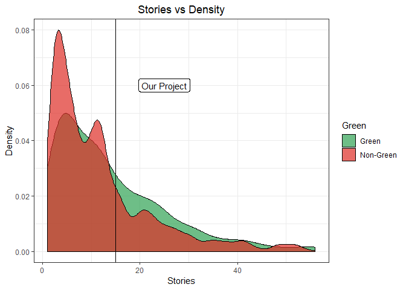
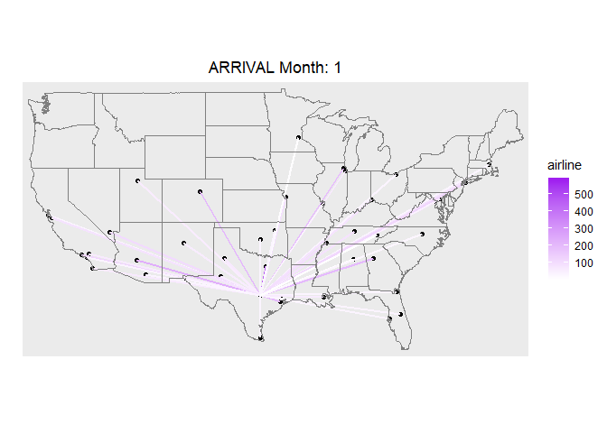

Exercise 1
==========

By Chong Wang, Tinaping Wu, Zhenning Zhao

Exercise 1.1
------------

The environmentally friendly buildings have some obvious advantages, not only from an eco-friendly view, but also from the financial aspect. The "data guru" did not make a reasonable argument to quantity the advantages clearly. To be more specific, we believe that the duration that he/she calculated to recover the cost may be mistaken.

The first step is to clean the data. The "data guru" noticed that a handful of the buildings in the data set had very low occupancy rates. Although this is a true fact, which can be shown in the graph above, he/she did not provide a satisfactory reason for why the buildings with less than 10% leasing rate should be removed from consideration. Due to this fact, we disagree to simply delete these 215 data points. Instead, we were able to identify a reason to delete buildings with 0% occupancy rate. According to a [research conducted by IBM](https://www.ibm.com/support/knowledgecenter/en/SSFCZ3_10.5.2/com.ibm.tri.doc/wpm_metrics/r_occupancy_rate.html), buildings with a 0% leasing rate is called “not-used buildings”. Since our new building will certainly be used, we can comfortably exclude these data points from the original data set.

After that, we tried to clean the data even furthur. Since this new project is in Austin with the tallest building at 56 floors, clusters with buildings higher than this value are clearly not in Austin and therefore should be removed from the data set. As the result, we are left with 6,618 data points.

 According to the "data guru", there are still many outliers after data cleaning, so he/she chooses to use the median instead of the mean to calculate the expected rent to compare green and non-green buildings. We plot the boxplot of green and non-green buildings to get a overview of the data. It seems that the "data guru" was right about the outliers, but it is unclear why there are so many outliers. So we digged deeper, and got some interesting findings.

    ##    Min. 1st Qu.  Median    Mean 3rd Qu.    Max. 
    ##    2378   47783  112924  200689  259000 3448680

Exercise 1.2
------------

Exercise 1.3
------------

In this exercise, we used K-nearest neighbors(KNN) to build a predictive model for price, given mileage, separately for each of two trim levels: 350 and 65 AMG. First, we run the KNN models for the trim level of 350. Here is the plot for mileage vs price for the trim level of 350:

We splited the data into a training and a testing set. There are 80% of the data are in the training set. Then we run the K-nearest-neighbors, for many different values of K, starting at K=3 and going as high as the sample size. For each value of K, fit the model to the training set and make predictions on the test set, and calculate the out-of-sample root mean-squared error (RMSE) for each value of K. The plot of K versus RSME is showed below:

The optimal K for trim level 350 is printed below:

    ## [1] 70

Since the traning set is chosen randomly, if we run the KNN for several times, we will get different result. But generally, we can get the optimal K for trim level 350 is about 19. Then for the optimal value of K in this one running, a plot of the fitted modelis shown below:

Second, we run the KNN models for the trim level of 65 AMG similarly. Here is the plot for mileage vs price for the trim level of 65 AMG:

We splited the data into a training and a testing set. There are 80% of the data are in the training set. Then we run the K-nearest-neighbors, for many different values of K, starting at K=3 and going as high as the sample size. For each value of K, fit the model to the training set and make predictions on the test set, and calculate the out-of-sample root mean-squared error (RMSE) for each value of K. The plot of K versus RSME is showed below:

The optimal K for trim level 65 AMG is printed below:

    ## [1] 7

Since the traning set is chosen randomly, if we run the KNN for several times, we will get different result. But generally, we can get the optimal K for trim level 65 AMG is about 16. Then for the optimal value of K in this one running, a plot of the fitted modelis shown below:

In the end, it is showed that the average optimal K for trim level 350 is 19, which is larger than optimal K = 16 for trim level 65 AMG. We think that this is because that the sample size for the first data subset is larger than the second, and hence has a larger optimal K.
