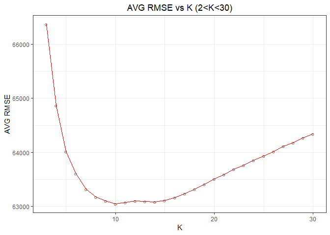
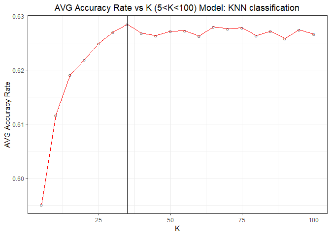

Exercise 2
==========

By Chong Wang, Tianping Wu, Zhenning Zhao

Exercise 2.1
------------

Long story short, we "hand-build" a model for price that outperforms the "medium" model that we considered in class, and the KNN model did not beat the “hand-build” model that we selected.

The models that we checked are listed below.

``` r
model1 = price ~ lotSize + age + livingArea + pctCollege + bedrooms + fireplaces + bathrooms + rooms + heating + fuel + centralAir
model2 = price ~ lotSize + age + livingArea + pctCollege*fireplaces + bedrooms  + bathrooms + rooms + heating + centralAir
model3 = price ~ landValue + livingArea + pctCollege + bedrooms + fireplaces + bathrooms + rooms + heating + fuel + centralAir
model4 = price ~ landValue + livingArea + bedrooms + bathrooms + rooms + heating + fuel + centralAir
model5 = price ~ landValue + lotSize*(bedrooms + bathrooms) + livingArea*(fuel+ heating + centralAir) + pctCollege*(fireplaces+age) + rooms
model6 = price ~ landValue + lotSize*bedrooms + livingArea*fuel + pctCollege*(fireplaces+age) + bathrooms + rooms + heating + centralAir
model7 = price ~ landValue + lotSize*bedrooms + livingArea*fuel + pctCollege*(fireplaces+age) + centralAir
```

The performance of the models are measured with average out-of-sample RMSE. We used the 80% of the data to do regressions and calculated RMSE for the rest 20%, and rerun the Monte Carlo training-testing split to calculate the average RMSE. The result of the models are listed below.

|         | AVG RMSE |
|---------|:--------:|
| model 1 | 65821.24 |
| model 2 | 65594.89 |
| model 3 | 59635.57 |
| model 4 | 59577.20 |
| model 5 | 58974.79 |
| model 6 | 59253.00 |
| model 7 | 60013.99 |

The best model that we solved is model 5. This model beats all the other models that we chose by having a smaller average RMSE is around 59,900, while the average RMSE of the baseline model is around 66,000. The regression result is:

|                                   | coefficients.Estimate | coefficients.Std..Error | coefficients.t.value | coefficients.Pr...t.. |
|-----------------------------------|:---------------------:|:-----------------------:|:--------------------:|:---------------------:|
| (Intercept)                       |     -8.643001e+03     |       1.770303e+04      |      -0.4882215      |       0.6254558       |
| landValue                         |      8.332313e-01     |       4.815750e-02      |      17.3022099      |       0.0000000       |
| lotSize                           |      8.886326e+03     |       8.083021e+03      |       1.0993817      |       0.2717569       |
| bedrooms                          |     -9.010594e+03     |       3.051553e+03      |      -2.9527897      |       0.0031923       |
| bathrooms                         |      2.423306e+04     |       3.872891e+03      |       6.2571003      |       0.0000000       |
| livingArea                        |      9.013328e+01     |       5.689994e+00      |      15.8406634      |       0.0000000       |
| fuelelectric                      |     -4.945208e+04     |       4.874015e+04      |      -1.0146066      |       0.3104374       |
| fueloil                           |      3.908867e+04     |       1.311235e+04      |       2.9810578      |       0.0029133       |
| heatinghot water/steam            |      1.277797e+04     |       1.276971e+04      |       1.0006468      |       0.3171397       |
| heatingelectric                   |      4.673921e+04     |       4.935837e+04      |       0.9469359      |       0.3438057       |
| centralAirNo                      |      3.461381e+04     |       1.046454e+04      |       3.3077241      |       0.0009602       |
| pctCollege                        |      1.982960e+01     |       2.603112e+02      |       0.0761765      |       0.9392876       |
| fireplaces                        |      4.139041e+04     |       1.479376e+04      |       2.7978287      |       0.0052026       |
| age                               |     -5.979931e+02     |       2.613114e+02      |      -2.2884313      |       0.0222343       |
| rooms                             |      2.539648e+03     |       9.776609e+02      |       2.5976782      |       0.0094665       |
| lotSize:bedrooms                  |      1.639476e+03     |       2.742749e+03      |       0.5977493      |       0.5500866       |
| lotSize:bathrooms                 |     -3.076214e+03     |       3.420065e+03      |      -0.8994609      |       0.3685343       |
| livingArea:fuelelectric           |      2.420885e+01     |       2.803848e+01      |       0.8634150      |       0.3880308       |
| livingArea:fueloil                |     -2.464235e+01     |       7.454578e+00      |      -3.3056672      |       0.0009672       |
| livingArea:heatinghot water/steam |     -1.068582e+01     |       6.773995e+00      |      -1.5774770      |       0.1148714       |
| livingArea:heatingelectric        |     -2.824654e+01     |       2.859791e+01      |      -0.9877132      |       0.3234334       |
| livingArea:centralAirNo           |     -2.527276e+01     |       5.479314e+00      |      -4.6123959      |       0.0000043       |
| pctCollege:fireplaces             |     -7.022711e+02     |       2.601372e+02      |      -2.6996180      |       0.0070106       |
| pctCollege:age                    |      1.042842e+01     |       4.879803e+00      |       2.1370580      |       0.0327353       |

From the regression we can find many factors that could influence the house price.

First of all, the most important factor is the land value. When we included the land value into account, the RMSE dropped dramatically. It is clearly true that the higher the land value is, the higher the house price is.

Second, the room with more bedrooms have a lower price. This makes sense because more bedrooms means there are more people sharing the apartment, hence the utility of each person is dropping. On the other hand, the apartment with more bathrooms have a higher price. The apartment with larger living area have a higher price, and the price of the apartment drops as the age of the apartment grows. These conclusions match our intuition.

Third, comparing with the apartments fueled with gas, the apartments fueled with oil have higher prices. Comparing with the apartments having a central air conditioner, the apartments with separate air conditioner have higher price. What’s more, the apartments with a fireplace are more expensive, and the older the apartment is the lower the price is.

Forth, the interactions between the number of bedrooms or bathrooms and the lotsize are not significant, but the interactions between the living area and the fuel and whether the house has a central air conditioner is significant. To be more specific, the effect of the living area on the price of the room fueled with oil is lower than the room fueled with gas. And it is also true that the effect of the living area on the price of the room without a central air conditioner is lower than the room that has a central air conditioner.The interactions between whether the apartment is close to a college and the age of the house and the number of fireplaces are significant.

However, by using exactly same variables in the linear regression model it is very hard to beat the linear regression with the KNN model.



From the plot of average RMSE vs K we can tell the optimal K for the KNN model is about 10-12. The lowest average RMSE that we can get with KNN model is about 63,000, which is still higher than the average RMSE that we conclude using a linear model with interactions.

Exercise 2.2
------------

### Exercise 2.2.1

First, in order to get the most accurate predictions of radiologists’ recall rates, we constructed three logistic models. Because we need to take consideration that all the risk factors need to be constant, we chose age, history of breast biopsy/surgery, breast cancer symptom, menopause/hormone-therapy status and breast density classification as independent variables and recall as dependent variable in our logistic model. After considering the chance of interactions, we selected three following models:

``` r
model1 = recall~radiologist*(age+history+symptoms+menopause+density)
model2 = recall~radiologist+age+history+symptoms+menopause+density
model3 = recall~(radiologist+age+history+symptoms+menopause+density)^2
```

The performance of the models are measured with error rate, which is calculated by sum of the right diagonal numbers of confusion matrix divided by 987 screening mammograms. We use the 80% of the data to do logistic regressions and calculate error rate for the rest 20%, and rerun the Monte Carlo training-testing split to calculate the average error rate. The threshold that we used for the calculation is about 0.151, which is the average rate for the recalled patients. The result of the models are listed below:

|         |  AVG RMSE |
|---------|:---------:|
| model 1 | 0.4033503 |
| model 2 | 0.4496447 |
| model 3 | 0.4069543 |

After running for several times, we found the error rates of model 1 and model 3 are significantly smaller than that of model 2. We used model 1 to predict in the following as the error rate of model 1 is slightly smaller than that of model 3.

Then, we randomly chose 100 samples, which consist of around 10% of 987 screening mammograms. After that, we repeated these 100 samples for 5 times each. In order to address the problem that the radiologists don’t see the same patients, we added an additional row, which is arranged by repeated series radiologist13, radiologist34, radiologist66, radiologist89 and radiologist95. Therefore, we let five radiologists see the same patients. Finally, we predicted the recall rates of each radiologist with model 1. The results are below.

| radiologist   |  Prob\_recall|
|:--------------|-------------:|
| radiologist13 |     0.1463884|
| radiologist34 |     0.0952479|
| radiologist66 |     0.1962011|
| radiologist89 |     0.2179940|
| radiologist95 |     0.1263765|

From the above table, we can clearly see that radiologist89 is most clinically conservative, whose recall rate is about 0.21. Radiologist66, radiologist13, radiologist95 and radiologist34, ranked 2nd, 3rd, 4th and 5th respectivelly in terms of clinically conservative index.

At last, we performed robust test on our results. We predicted recall rates by using model 2 and model 3. The below tables showed the results, which are consistent with the result predicted by model 1.

    ## [1] "model 2"

| radiologist   |  Prob\_recall|
|:--------------|-------------:|
| radiologist13 |     0.1310649|
| radiologist34 |     0.0807986|
| radiologist66 |     0.1780884|
| radiologist89 |     0.1926796|
| radiologist95 |     0.1247958|

    ## [1] "model 3"

| radiologist   |  Prob\_recall|
|:--------------|-------------:|
| radiologist13 |     0.1514313|
| radiologist34 |     0.0662035|
| radiologist66 |     0.2225787|
| radiologist89 |     0.2350007|
| radiologist95 |     0.1318182|

In conclusion, holding patient risk factors equal, the order of clinically conservative characteristic in recalling patients is: radiologist89 &gt; radiologist66 &gt; radiologist13 &gt; radiologist95 &gt; radiologist34, when letting radiologists see the same patients.

### Exercise 2.2.2

The second point that we want to make is that when the radiologists at this hospital interpret a mammogram to make a decision on whether to recall the patient, they should be weighing the history of the patients, the breast cancer symptoms and the menopause status of the patient more heavily than they currently are. Although this means they have to recall more patients back for further checks, it will minimize the false negative rate, identifying more precisely the patients who do end up getting cancer, so that they can be treated as early as possible.

First we built the baseline model, which suggests that when the doctors recall a patient, they tend to think that the patient has a cancer.

To formalize the model by regression, we regressed the patient’s cancer outcome on the radiologist’s recall decision with the logistic regression. The regression model is:

``` r
baseline = cancer ~ recall
```

We splited the dataset into the training set and the testing set using the standard 80-20 rule, and re-run the regression for 100 times to eliminate the stochasticity, and ending up with similar rates to the ones calculated with the entire database.

If we build a model using the recall decision and all the other clinical risk factors and it significantly performs better than the baseline model, it means that there are some risk factors that the doctors are missing.

We checked (1) the model regressing cancer indicator on the recall indicator and all the risk factors, (2) the model regressing cancer indicator on the recall indicator and all the risk factors and their interactions (3) two hand-build models. The thresholds that we chose for these models are the same as the baseline model, so that we can compare these models on the same level. The regression models are:

``` r
model1 = cancer ~ recall + age + history + symptoms + menopause + density
model2 = cancer ~ recall + (age + history + symptoms + menopause + density)^2
model3 = cancer ~ recall + history + symptoms + menopause
```

Before we show the result of the models, we need to explain the criteria that we use to judge these model. When we try to identify the patient, different kinds of error has different cost. It might not be a big problem if a healthy woman is recalled to do some further test, but it may cause death if the doctor didn’t identify the patients who have cancer. Hence the accurate rate is not the best criteria. Instead, we calculate the deviance of these model, and choose the model with smaller deviance.

The average deviance of the models are listed in the following table:

|          | AVG Deviance for Different Models |
|----------|:---------------------------------:|
| Baseline |              1.449282             |
| Model 1  |              1.505878             |
| Model 2  |              1.540937             |
| Model 3  |              1.386806             |

From the table we can tell that the Model 3 has the lowest average deviation, which means we can perform better than the doctors currently do if they give more weight on the terms in Model 3. Overall we can say that the doctors did great jobs at identifying the patients who do get cancer. the drop between Model3 and the baseline is very small.

The logistic regression of model 3 using the whole dataset is shown below:

|                          | coefficients.Estimate | coefficients.Std..Error | coefficients.t.value | coefficients.Pr...t.. |
|--------------------------|:---------------------:|:-----------------------:|:--------------------:|:---------------------:|
| (Intercept)              |       0.0165484       |        0.0109027        |       1.5178354      |       0.1293784       |
| recall                   |       0.1299492       |        0.0165467        |       7.8534925      |       0.0000000       |
| history                  |       0.0079463       |        0.0155115        |       0.5122888      |       0.6085643       |
| symptoms                 |       0.0119353       |        0.0273940        |       0.4356900      |       0.6631576       |
| menopausepostmenoNoHT    |       -0.0010441      |        0.0142239        |      -0.0734067      |       0.9414975       |
| menopausepostmenounknown |       0.0410178       |        0.0328765        |       1.2476318      |       0.2124640       |
| menopausepremeno         |       -0.0058343      |        0.0152413        |      -0.3827939      |       0.7019556       |

From the regression result we can tell that the doctor should consider more about the patient’s history, the breast cancer symptoms and the menopause status of the patient. More specifically, if a person has the history of having cancer, or she has the breast cancer symptoms, or the hormone-therapy status is unknown, she is more likely to have cancers. This result matches our intuition.

To compare the result, we made some predictions with the baseline model and the model we choose.The threshold of positive prediction is chosen as 0.0395, which is slightly higher than the prior probability of having a cancer.

The confusion matrix for the baseline model using the entire dataset is:

|            | prediction = 0 | prediction = 1 |
|------------|:--------------:|:--------------:|
| cancer = 0 |       824      |       126      |
| cancer = 1 |       15       |       22       |

The accuracy rate is (824+22)/987 = 85.7%, the false negative rate is 15/(22+15) = 40.5%, the false positive rate is 126/(126+22) = 85.1%.

The confusion matrix for the model using the entire dataset is:

|            | prediction = 0 | prediction = 1 |
|------------|:--------------:|:--------------:|
| cancer = 0 |       797      |       153      |
| cancer = 1 |       14       |       23       |

The accuracy rate is (797+23)/987 = 83.1%, the false negative rate is 14/(23+14) = 37.8%, the false positive rate is 153/(153+23) = 86.9%.

Although this is the insample rates, we can still conclude that the false negative rate is decreasing, which means it will lower the false negative rate, identifying more precisely the patients who do end up getting cancer, so that they can be treated as early as possible, while the false positive rate is slightly increasing, meaning the doctors have to be more conservative and hence slightly increase the rate of the false alert. However, clearly the fact that we identified more cancer patients matters more.

Exercise 2.3
------------

The goal of this question is to build a model to predict whether an online article goes viral or not. Also from the model we would like to know how to improve an article’s chance of reaching Mashable’s cutoff threshold, 1,400 shares.

### Benchmark

First we set up our baseline model for predicting which articles go viral. Out of the 39,644 articles, 19,562 of them have gone viral. This means that even if we blindly predict all articles do not go viral, the accuracy rate would reach 50.7%. We will set this number as our baseline accuracy rate and attempt to improve it as much as we can.

### Model Construction

There are 2 approaches to building forecasting model, 1. Predict the number of shares first then classify if each article goes viral by comparing to the threshold of 1,400 shares. 2. Classify the the viral status first by comparing each article to the threshold of 1,400 shares, then directly predict viral status as the target variable.

For the first approach, we used linear modeling, with different combinations of interaction terms, polynomial terms, and transformations. The improvement in accuracy rate is rather minimal, as some of our models shown below. (Each of the variations)

``` r
share_LM1 = shares ~ n_tokens_title + n_tokens_content + num_hrefs + 
  num_self_hrefs + num_imgs + num_videos + 
  average_token_length + num_keywords + data_channel_is_lifestyle +
  data_channel_is_entertainment + data_channel_is_bus + 
  data_channel_is_socmed + data_channel_is_tech +
  data_channel_is_world + self_reference_avg_sharess +
  weekday_is_monday + weekday_is_tuesday + weekday_is_wednesday + 
  weekday_is_thursday + weekday_is_friday + weekday_is_saturday
share_LM2 = shares ~ (n_tokens_title + n_tokens_content + num_hrefs +
                        num_self_hrefs + num_imgs + num_videos + 
                        average_token_length + num_keywords + data_channel_is_lifestyle + 
                        data_channel_is_entertainment + data_channel_is_bus +
                        data_channel_is_socmed + data_channel_is_tech +
                        data_channel_is_world + self_reference_avg_sharess + 
                        weekday_is_monday + weekday_is_tuesday + weekday_is_wednesday +
                        weekday_is_thursday + weekday_is_friday + weekday_is_saturday)^2
share_LM3 = shares ~ poly(n_tokens_title, 3) + poly(num_hrefs, 2) + poly(num_imgs, 2) + poly(num_videos, 2) +
  poly(average_token_length, 3) + poly(num_keywords, 2) + poly(n_tokens_content, 2) +
  data_channel_is_lifestyle + data_channel_is_entertainment + data_channel_is_bus + 
  data_channel_is_socmed + data_channel_is_tech +
  data_channel_is_world + poly(self_reference_avg_sharess,2) + 
  weekday_is_monday + weekday_is_tuesday + weekday_is_wednesday + 
  weekday_is_thursday + weekday_is_friday + weekday_is_saturday + 
  poly(max_positive_polarity, 3) + poly(max_negative_polarity, 3)
share_LM4 = shares ~ n_tokens_title + n_tokens_content + num_hrefs + 
  num_self_hrefs + num_imgs + num_videos + 
  average_token_length + num_keywords + data_channel_is_lifestyle +
  data_channel_is_entertainment + data_channel_is_bus + 
  data_channel_is_socmed + data_channel_is_tech + 
  data_channel_is_world + self_reference_avg_sharess +
  weekday_is_monday + weekday_is_tuesday + weekday_is_wednesday + 
  weekday_is_thursday + weekday_is_friday + weekday_is_saturday
```

The average accurate rate for these for model is listed in the following table.

|           |  Accurate Rate|
|-----------|--------------:|
| share-LM1 |      0.4965380|
| share-LM2 |      0.5111035|
| share-LM3 |      0.5024518|
| share-LM4 |      0.5938492|

All the results above are the average of running against 100 random train/test splits.

Share-LM4 had the highest accuracy rate, so we report the confusion matrix. The following confusion matrix consists the testing data result from one iteration. In addition to the accuracy rate, we calculated the overall error rate, true positive rate and false positive rate in 100 iterations and took the average for each.

|           | prediction = 0 | prediction = 1 |
|-----------|:--------------:|:--------------:|
| viral = 0 |      1375      |      2649      |
| viral = 1 |       561      |      3344      |

Accuracy rate: 0.592

Overall error rate: 0.408

True positive rate: 0.856

False positive rate:0.659

Next, we moved on to the second approach. As the the viral status is binomial, in addition to the linear modelling, we were also able to exploit the logit model. The two logit models that we used are listed below:

``` r
viral_LM = viral ~ n_tokens_title + n_tokens_content + num_hrefs + 
                     num_self_hrefs + num_imgs + num_videos + 
                     average_token_length + num_keywords + data_channel_is_lifestyle + 
                     data_channel_is_entertainment + data_channel_is_bus + 
                     data_channel_is_socmed + data_channel_is_tech + 
                     data_channel_is_world + self_reference_avg_sharess + 
                     weekday_is_monday + weekday_is_tuesday + weekday_is_wednesday + 
                     weekday_is_thursday + weekday_is_friday + weekday_is_saturday
GLM = viral ~ n_tokens_title + n_tokens_content + num_hrefs + 
                       num_self_hrefs + num_imgs + num_videos + 
                       average_token_length + num_keywords + data_channel_is_lifestyle + 
                       data_channel_is_entertainment + data_channel_is_bus + 
                       data_channel_is_socmed + data_channel_is_tech + 
                       data_channel_is_world + self_reference_avg_sharess + 
                       weekday_is_monday + weekday_is_tuesday + weekday_is_wednesday + 
                       weekday_is_thursday + weekday_is_friday + weekday_is_saturday
```

After conducting trial and error with different forms of explanatory variables as in the first approach, the highest accuracy rate with the best configurations are shown below.

|          |  Accurate Rate|
|----------|--------------:|
| viral-LM |      0.6262984|
| GLM      |      0.6270904|

All the results above are the average of running against 100 random train/test splits.

The second approach turned out to be better, providing us with higher accuracy rate. In addition, as a supplement, we also explored the KNN method. The result was similar to the linear/logit models, as shown below.



the result above are the average of running 5 train/test splits iterations.

We now report the confusion matrix with the logit model which provided us the highest accuracy rate. The following confusion matrix consists the testing data result in one iteration. In addition to the accuracy rate, we calculated the overall error rate, true positive rate and false positive rate in 100 iterations and took the average for each.

|           | prediction = 0 | prediction = 1 |
|-----------|:--------------:|:--------------:|
| viral = 0 |      2494      |      1530      |
| viral = 1 |      1412      |      2493      |

Accuracy rate: 0.627

Overall error rate: 0.373

True positive rate: 0.634

False positive rate:0.376

### Conclusion

The second approach, threshold first and regress/classify second, performed better than the first one with log transformation which was just under 60%. Our logit model reached 62.7% accuracy rate, approximately 23.7% (0.627/0.507 - 1) improvement relative to our benchmark.

One possibility that our first approach performed worse is that our explanatory variables are not good at creating a low variance linear relationship to predict numerical amount of shares. Under similar set of conditions, articles range high in both &gt;1,400 and &lt;1,400, resulting low accuracy rate. Once we take the log transformation of shares, variance goes down, providing us a better result . On the other hand, after we first classified articles into a binary variable, viral and non-viral, the variance in predicting numerical number of shares are eliminated, so that our explanatory variables seem to be relatively better at predicting how likely each article goes viral at 50% mark (&gt;50% then predict viral, &lt;50% then predict non-viral).

|                                  | coefficients.Estimate | coefficients.Std..Error | coefficients.z.value | coefficients.Pr...z.. |
|----------------------------------|:---------------------:|:-----------------------:|:--------------------:|:---------------------:|
| (Intercept)                      |       0.9529115       |        0.1020576        |       9.336997       |       0.0000000       |
| n\_tokens\_title                 |       -0.0092257      |        0.0050772        |       -1.817091      |       0.0692032       |
| n\_tokens\_content               |       0.0001644       |        0.0000280        |       5.872242       |       0.0000000       |
| num\_hrefs                       |       0.0128979       |        0.0012438        |       10.370169      |       0.0000000       |
| num\_self\_hrefs                 |       -0.0271880      |        0.0032155        |       -8.455383      |       0.0000000       |
| num\_imgs                        |       0.0064140       |        0.0015081        |       4.253075       |       0.0000211       |
| num\_videos                      |       0.0043642       |        0.0027552        |       1.583977       |       0.1131989       |
| average\_token\_length           |       -0.0984953      |        0.0131119        |       -7.511930      |       0.0000000       |
| num\_keywords                    |       0.0464659       |        0.0057822        |       8.035971       |       0.0000000       |
| data\_channel\_is\_lifestyle     |       -0.1864650      |        0.0543287        |       -3.432161      |       0.0005988       |
| data\_channel\_is\_entertainment |       -0.8593291      |        0.0383385        |      -22.414287      |       0.0000000       |
| data\_channel\_is\_bus           |       -0.2843569      |        0.0407319        |       -6.981184      |       0.0000000       |
| data\_channel\_is\_socmed        |       0.6317587       |        0.0558869        |       11.304234      |       0.0000000       |
| data\_channel\_is\_tech          |       0.0930711       |        0.0393092        |       2.367665       |       0.0179008       |
| data\_channel\_is\_world         |       -0.9613410      |        0.0388580        |      -24.739861      |       0.0000000       |
| self\_reference\_avg\_sharess    |       0.0000069       |        0.0000008        |       9.211522       |       0.0000000       |
| weekday\_is\_monday              |       -0.6923313      |        0.0486246        |      -14.238281      |       0.0000000       |
| weekday\_is\_tuesday             |       -0.8023188      |        0.0480387        |      -16.701497      |       0.0000000       |
| weekday\_is\_wednesday           |       -0.8106103      |        0.0480153        |      -16.882327      |       0.0000000       |
| weekday\_is\_thursday            |       -0.7486349      |        0.0481060        |      -15.562198      |       0.0000000       |
| weekday\_is\_friday              |       -0.5842591      |        0.0497025        |      -11.755127      |       0.0000000       |
| weekday\_is\_saturday            |       0.2243040       |        0.0615516        |       3.644164       |       0.0002683       |

To improve an article’s chance of reaching Mashable’s cutoff threshold, 1,400 shares, we can look at the explanatory variable coefficients with the highest positive magnitude. From our best logit model, the top 3 factors that contribute to high shares are 1. article is under social media channel, 2. article published on Saturday, and 3. article is under technological channel. Top 3 factors to avoid are, 1. article is under world channel, 2. article published on Tuesday, 3. article is under entertainment channel. So given what we have, the best chance to make an article viral is to publish it under crossed social media & technological channel on Saturday.
