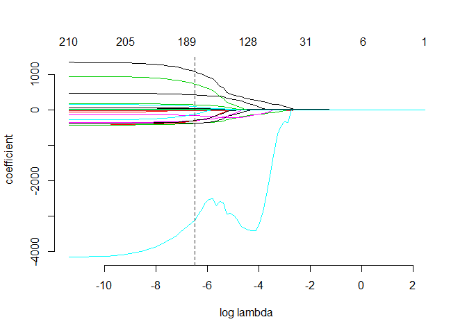
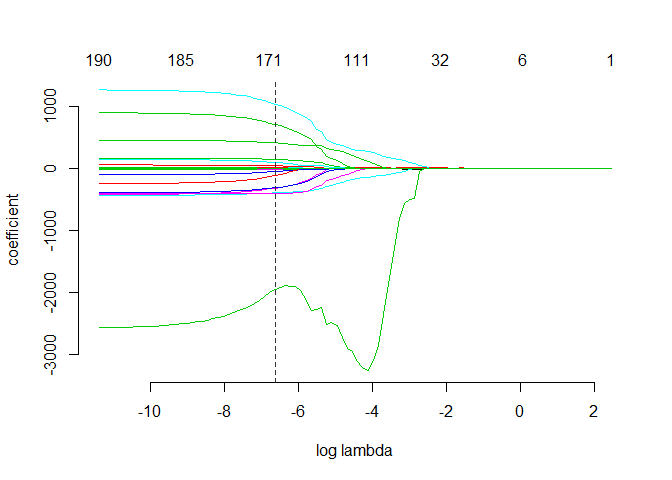

Exercise 3
==========

By Chong Wang, Tianping Wu, Zhenning Zhao

Exercise 3.1
------------

### Build the best predictive model possible for price.

Before assembling the model, we first cleaned the data. We deleted buildings with 0% leasing rate and lowered the scale of size of the buildings by 1,000 square foot to comply with the computation limit. As we mentioned in the first exercise, we deleted the data with occupancy rate equal to 0% because we believe that these buildings are abnormal. Next, we used the stepwise selection method to assemble the predictive model for price. Two models were built with a minor tweak.

The first model considered LEED and EnergyStar separately and the second model combined them into a single "green certified" category. In both models, we started with the null model by regressing rent on one, followed by adding new variables as demonstrated in the forward selection method. Using this model as our starting point model, we ran stepwise selection and obtained our final model.

The two selected models are shown below. Including the interaction terms, we had 45 and 44 significant coefficients, respectively.

    ## Rent ~ cluster_rent + size + class_a + class_b + cd_total_07 + 
    ##     age + cluster + net + Electricity_Costs + hd_total07 + leasing_rate + 
    ##     LEED + amenities + cluster_rent:size + size:cluster + cluster_rent:cluster + 
    ##     class_b:age + class_a:age + cd_total_07:net + cd_total_07:hd_total07 + 
    ##     cluster_rent:age + size:leasing_rate + size:Electricity_Costs + 
    ##     size:class_a + age:Electricity_Costs + cluster_rent:leasing_rate + 
    ##     cluster_rent:net + cluster_rent:LEED + Electricity_Costs:hd_total07 + 
    ##     size:cd_total_07 + cluster:Electricity_Costs + class_a:cd_total_07 + 
    ##     cluster:hd_total07 + cluster_rent:hd_total07 + size:age + 
    ##     size:class_b + class_b:amenities + size:amenities + Electricity_Costs:amenities + 
    ##     cluster_rent:amenities + cluster:leasing_rate + age:cluster + 
    ##     size:hd_total07 + age:LEED

    ## Rent ~ cluster_rent + size + class_a + class_b + cd_total_07 + 
    ##     age + cluster + net + Electricity_Costs + hd_total07 + leasing_rate + 
    ##     green_rating + amenities + cluster_rent:size + size:cluster + 
    ##     cluster_rent:cluster + class_b:age + class_a:age + cd_total_07:net + 
    ##     cd_total_07:hd_total07 + cluster_rent:age + size:leasing_rate + 
    ##     size:Electricity_Costs + size:class_a + age:Electricity_Costs + 
    ##     cluster_rent:leasing_rate + cluster_rent:net + Electricity_Costs:hd_total07 + 
    ##     size:cd_total_07 + cluster:Electricity_Costs + cluster:hd_total07 + 
    ##     class_a:cd_total_07 + size:age + size:class_b + size:hd_total07 + 
    ##     cluster_rent:hd_total07 + green_rating:amenities + size:amenities + 
    ##     class_b:amenities + cluster_rent:amenities + Electricity_Costs:amenities + 
    ##     cluster:leasing_rate + age:cluster

We then used the Lasso model to assemble the best predictive model possible for price. Two models were also built with this method, the model considering LEED and EnergyStar separately, and the model combining them into a single "green certified" category. We considered the interaction terms as well.

In the first model, from the path plot below we could see that minimum AIC occurs at segment 65.

Thus, we used the model at the segment 65 and chose 184 coefficients. The specific model is shown below.

    ## Rent ~ cluster + size + leasing_rate + stories + age + renovated + 
    ##     class_a + class_b + LEED + Energystar + net + amenities + 
    ##     hd_total07 + total_dd_07 + Precipitation + Electricity_Costs + 
    ##     cluster_rent + cluster:size + cluster:empl_gr + cluster:leasing_rate + 
    ##     cluster:stories + cluster:age + cluster:renovated + cluster:class_a + 
    ##     cluster:class_b + cluster:LEED + cluster:Energystar + cluster:net + 
    ##     cluster:hd_total07 + cluster:total_dd_07 + cluster:Precipitation + 
    ##     cluster:Gas_Costs + cluster:Electricity_Costs + cluster:cluster_rent + 
    ##     size:empl_gr + size:leasing_rate + size:stories + size:age + 
    ##     size:renovated + size:class_a + size:class_b + size:LEED + 
    ##     size:Energystar + size:net + size:amenities + size:cd_total_07 + 
    ##     size:hd_total07 + size:Precipitation + size:Gas_Costs + size:Electricity_Costs + 
    ##     size:cluster_rent + empl_gr:leasing_rate + empl_gr:stories + 
    ##     empl_gr:age + empl_gr:renovated + empl_gr:class_b + empl_gr:LEED + 
    ##     empl_gr:net + empl_gr:amenities + empl_gr:hd_total07 + empl_gr:Precipitation + 
    ##     empl_gr:Electricity_Costs + empl_gr:cluster_rent + leasing_rate:stories + 
    ##     leasing_rate:age + leasing_rate:class_a + leasing_rate:class_b + 
    ##     leasing_rate:LEED + leasing_rate:net + leasing_rate:amenities + 
    ##     leasing_rate:cd_total_07 + leasing_rate:hd_total07 + leasing_rate:total_dd_07 + 
    ##     leasing_rate:Precipitation + leasing_rate:Gas_Costs + leasing_rate:Electricity_Costs + 
    ##     leasing_rate:cluster_rent + stories:age + stories:renovated + 
    ##     stories:class_a + stories:class_b + stories:LEED + stories:Energystar + 
    ##     stories:net + stories:amenities + stories:cd_total_07 + stories:hd_total07 + 
    ##     stories:Precipitation + stories:Gas_Costs + stories:Electricity_Costs + 
    ##     stories:cluster_rent + age:renovated + age:class_a + age:class_b + 
    ##     age:LEED + age:Energystar + age:net + age:amenities + age:cd_total_07 + 
    ##     age:hd_total07 + age:total_dd_07 + age:Precipitation + age:Gas_Costs + 
    ##     age:Electricity_Costs + age:cluster_rent + renovated:class_a + 
    ##     renovated:class_b + renovated:LEED + renovated:Energystar + 
    ##     renovated:net + renovated:amenities + renovated:cd_total_07 + 
    ##     renovated:hd_total07 + renovated:total_dd_07 + renovated:Precipitation + 
    ##     renovated:Gas_Costs + renovated:Electricity_Costs + renovated:cluster_rent + 
    ##     class_a:LEED + class_a:Energystar + class_a:net + class_a:amenities + 
    ##     class_a:cd_total_07 + class_a:hd_total07 + class_a:total_dd_07 + 
    ##     class_a:Precipitation + class_a:Gas_Costs + class_a:Electricity_Costs + 
    ##     class_a:cluster_rent + class_b:LEED + class_b:Energystar + 
    ##     class_b:net + class_b:amenities + class_b:cd_total_07 + class_b:hd_total07 + 
    ##     class_b:total_dd_07 + class_b:Precipitation + class_b:Gas_Costs + 
    ##     class_b:Electricity_Costs + class_b:cluster_rent + LEED:Energystar + 
    ##     LEED:net + LEED:amenities + LEED:cd_total_07 + LEED:total_dd_07 + 
    ##     LEED:Precipitation + LEED:Gas_Costs + LEED:Electricity_Costs + 
    ##     LEED:cluster_rent + Energystar:net + Energystar:amenities + 
    ##     Energystar:cd_total_07 + Energystar:total_dd_07 + Energystar:Precipitation + 
    ##     Energystar:Electricity_Costs + Energystar:cluster_rent + 
    ##     net:amenities + net:cd_total_07 + net:total_dd_07 + net:Precipitation + 
    ##     net:Gas_Costs + net:Electricity_Costs + net:cluster_rent + 
    ##     amenities:hd_total07 + amenities:total_dd_07 + amenities:Precipitation + 
    ##     amenities:Gas_Costs + amenities:Electricity_Costs + amenities:cluster_rent + 
    ##     cd_total_07:hd_total07 + cd_total_07:total_dd_07 + cd_total_07:Precipitation + 
    ##     cd_total_07:Electricity_Costs + cd_total_07:cluster_rent + 
    ##     hd_total07:total_dd_07 + hd_total07:Precipitation + hd_total07:cluster_rent + 
    ##     Precipitation:Gas_Costs + Precipitation:Electricity_Costs + 
    ##     Precipitation:cluster_rent + Gas_Costs:Electricity_Costs + 
    ##     Gas_Costs:cluster_rent + Electricity_Costs:cluster_rent

In the second model, from the path plot below we could see that minimum AIC occurs at segment 66.

Thus, we used the model at the segment 66 and chose 168 coefficients. The specific model is shown below.

    ## Rent ~ cluster + size + leasing_rate + stories + age + renovated + 
    ##     class_a + class_b + green_rating + net + amenities + hd_total07 + 
    ##     total_dd_07 + Precipitation + Electricity_Costs + cluster_rent + 
    ##     cluster:size + cluster:empl_gr + cluster:leasing_rate + cluster:stories + 
    ##     cluster:age + cluster:renovated + cluster:class_a + cluster:class_b + 
    ##     cluster:green_rating + cluster:net + cluster:amenities + 
    ##     cluster:hd_total07 + cluster:total_dd_07 + cluster:Precipitation + 
    ##     cluster:Gas_Costs + cluster:Electricity_Costs + cluster:cluster_rent + 
    ##     size:empl_gr + size:leasing_rate + size:stories + size:age + 
    ##     size:renovated + size:class_a + size:class_b + size:green_rating + 
    ##     size:amenities + size:cd_total_07 + size:hd_total07 + size:Precipitation + 
    ##     size:Gas_Costs + size:Electricity_Costs + size:cluster_rent + 
    ##     empl_gr:leasing_rate + empl_gr:stories + empl_gr:age + empl_gr:renovated + 
    ##     empl_gr:class_b + empl_gr:green_rating + empl_gr:amenities + 
    ##     empl_gr:hd_total07 + empl_gr:Precipitation + empl_gr:Electricity_Costs + 
    ##     empl_gr:cluster_rent + leasing_rate:stories + leasing_rate:age + 
    ##     leasing_rate:class_a + leasing_rate:class_b + leasing_rate:green_rating + 
    ##     leasing_rate:net + leasing_rate:amenities + leasing_rate:cd_total_07 + 
    ##     leasing_rate:hd_total07 + leasing_rate:total_dd_07 + leasing_rate:Precipitation + 
    ##     leasing_rate:Gas_Costs + leasing_rate:Electricity_Costs + 
    ##     leasing_rate:cluster_rent + stories:age + stories:renovated + 
    ##     stories:class_a + stories:class_b + stories:green_rating + 
    ##     stories:net + stories:amenities + stories:cd_total_07 + stories:hd_total07 + 
    ##     stories:Precipitation + stories:Gas_Costs + stories:Electricity_Costs + 
    ##     stories:cluster_rent + age:renovated + age:class_a + age:class_b + 
    ##     age:green_rating + age:net + age:amenities + age:cd_total_07 + 
    ##     age:hd_total07 + age:total_dd_07 + age:Precipitation + age:Gas_Costs + 
    ##     age:Electricity_Costs + age:cluster_rent + renovated:class_a + 
    ##     renovated:class_b + renovated:green_rating + renovated:net + 
    ##     renovated:amenities + renovated:cd_total_07 + renovated:hd_total07 + 
    ##     renovated:total_dd_07 + renovated:Precipitation + renovated:Gas_Costs + 
    ##     renovated:Electricity_Costs + renovated:cluster_rent + class_a:green_rating + 
    ##     class_a:net + class_a:amenities + class_a:cd_total_07 + class_a:hd_total07 + 
    ##     class_a:total_dd_07 + class_a:Precipitation + class_a:Gas_Costs + 
    ##     class_a:Electricity_Costs + class_a:cluster_rent + class_b:green_rating + 
    ##     class_b:net + class_b:amenities + class_b:cd_total_07 + class_b:hd_total07 + 
    ##     class_b:total_dd_07 + class_b:Precipitation + class_b:Gas_Costs + 
    ##     class_b:Electricity_Costs + class_b:cluster_rent + green_rating:net + 
    ##     green_rating:amenities + green_rating:cd_total_07 + green_rating:hd_total07 + 
    ##     green_rating:Precipitation + green_rating:Gas_Costs + green_rating:Electricity_Costs + 
    ##     green_rating:cluster_rent + net:amenities + net:cd_total_07 + 
    ##     net:total_dd_07 + net:Precipitation + net:Gas_Costs + net:Electricity_Costs + 
    ##     net:cluster_rent + amenities:hd_total07 + amenities:total_dd_07 + 
    ##     amenities:Precipitation + amenities:Gas_Costs + amenities:Electricity_Costs + 
    ##     amenities:cluster_rent + cd_total_07:hd_total07 + cd_total_07:total_dd_07 + 
    ##     cd_total_07:Precipitation + cd_total_07:Electricity_Costs + 
    ##     cd_total_07:cluster_rent + hd_total07:total_dd_07 + hd_total07:Precipitation + 
    ##     hd_total07:cluster_rent + total_dd_07:Electricity_Costs + 
    ##     Precipitation:Gas_Costs + Precipitation:Electricity_Costs + 
    ##     Precipitation:cluster_rent + Gas_Costs:Electricity_Costs + 
    ##     Gas_Costs:cluster_rent + Electricity_Costs:cluster_rent

Lastly, in order to compare 4 models above, we used k-fold cross validation. We arbitrarily set k equal to 10 and calculated the CVs. We found that the CVs of the stepwise selection models are lower than those by Lasso method. The second stepwise model with the combined "green certified" category had the minimum CV, and therefore it is our best predictive model possible for rent price.

    ## [1] 9.158497 9.154099 9.186821 9.126833

### Use this model to quantify the average change in rental income per square foot (whether in absolute or percentage terms) associated with green certification, holding other features of the building constant.

    ##           green_rating green_rating:amenities 
    ##               2.294792              -2.150574

Holding all other significant features of the building fixed, green certified (LEED or EnergyStar) buildings are expected to be 2.29 dollars per square foot per calendar year more expensive in comparison to non-green buildings. However, interestingly when buildings have amenities available on site, the positive effect of the green certification on rental income is significantly neutralized, an expected decrease of 2.15 dollars per square foot per calendar year.

### Assess whether the "green certification" effect is different for different buildings, or instead whether it seems to be roughly similar across all or most buildings.

In the model selected by stepwise method with combined green rate variable, we could see that holding all other significant features of the building fixed, green certification buildings with amenities is 2.15 dollar per square foot per calendar year less than green certification buildings without amenities. It shows that "green certification" effect is different for buildings of with and without amenities. The intuition behind is that the green buildings with amenities are normally considered as commercial buildings, so the buildings need to pay the energy fee as commercial rate, which is normally higher than residential rate. Thus, residents in the green buildings with amenities still need to pay more than those in the green buildings without amenities. Thus, the owners of green buildings with amenities will lower the rent fee in order to attract more residents.

Exercise 3.2
------------

### Why can’t I just get data from a few different cities and run the regression of “Crime” on “Police” to understand how more cops in the streets affect crime?

We cannot just do the simple regression of “Crime” on “Police” because although Crime rate depends on police force, the demand of police force might also depend on the crime rate. One could assume that when a city put more police on the street the crime rate tends to drop, and more police is needed if the crime rate of a city is high. So it’s actually 2 equations other than one to be regressed. However, the data that we have on hand mixed these two effects so that we cannot tell what is the cause for the changes in the crime rate. So we cannot simply do the regression of “Crime” on “Police”.

### How were the researchers from UPenn able to isolate this effect? Briefly describe their approach and discuss their result in the “Table 2” below, from the researcher's paper.

The researchers from UPenn took the endogeneity problem into consideration and included an instrument variable that is days with a high alert and a control variable that is ridership in order to isolate this effect. They first collected DC’s crime data as well as data of days when there was a high alert for potential terrorist attacks.

Because in the days when there’s a high alert for potential terrorist attacks, the mayor of DC will respond to that actively by sending more cops in the street, that decision made by mayor has no intention to reduce the crime in the street. In the days when there’s a high alert, people may not go out, thus the chances of the crime will decrease which induce less crimes that was not caused by more cops in those days. The researchers then chose ridership as a control variable. If the number of ridership is as usual, that means the number of people do not decrease due to the high alert; If the number of ridership is less as usual, that means the number of people decrease due to the high alert. Thus, researchers need to control the ridership. From table 1, we saw that days with a high alert have lower crimes, since the coefficient is -6.046, which is also significant at 5% level after including the control variable ridership.

Thus, holding the number of people go out in the days when there’s a high alert fixed (holding the ridership fixed), the crime becomes lower in those days is due to more cops in the street.

### Why did they have to control for Metro ridership? What was that trying to capture?

Although the technology mentioned above is very genius, someone might argue that it might not be true that the correlation between the alert and the crime rate is zero. During the high alert days people might be too scared to go out, so there might be less chances for crime opportunities, leading to a lower crime rate.

Hence, the researcher controlled for Metro ridership (as a way of measuring population outdoor activeness) and rerun the regression again. If the result of regressing crime rate on police force controlling the ridership is still negative, then it’s more convincible to say that the regression captures the influence of police force on crime rate.

From the second regression of table 2, it is shown that holding the ridership fixed, the parameter in front of the police force is still negative. This result in some degree rules out the possibility that mentioned above. However, we can’t for sure prove that more cops leads to less crime. The street criminals might be too afraid of terrorists and decide not to go out and during a high alert day. This would lead to a reduction in crime that is not related to more police in the streets.

### Below I am showing you "Table 4" from the researchers' paper. Just focus on the first column of the table. Can you describe the model being estimated here? What is the conclusion?

Table 4 demonstrates on effect of high alert on crime across different districts in DC. By having models with interaction terms between districts and alert days, it can be shown that only the effect in district 1 is significant. High alert days with more cops bring the daily total number of crimes down in district 1. This makes sense because D.C. would most likely deploy high ratio of the extra cops in this district for security reasons as terrorists targets like US Capitol,the White House, Federal Triangle and US Supreme Court are all there. The effects in the other districts are insignificant as the confidence interval lies on the coefficient of zero.
