Exercise 4
==========

By Chong Wang, Tianping Wu, Zhenning Zhao

Exercise 4.1 Clustering and PCA
-------------------------------

### Distinguishing the color of the wine

First we normalize the data. After demeaning and scaling with their standard deviation, we end up with a 6,497\*11 dataset. The following is the heatmap of the correlation between these 11 chemical properties.

Although there are 11 chemical properties, we choose to visualize the data through only 4 dimensions: total sulfur dioxide, density, pH, and volatile acidity. The following graph shows the distribution of the red wines and the white wine on these 4 dimensions. We randomly pick these 4 properties to give a first taste of the data. From the graph we can tell that the red wine and the white wine have different features, so it is highly possible for us to distinguish these two different type of wines.

Since we have already have a basic impression of 2 categories in mind, we choose to do clustering with K=2.

First, by using K-means, we can divide the wines into 2 category. Visualizing through the total sulfur dioxide and the density, we can tell that K=means did an excellent work distinguishing red wines and white wines.

More specifically, we can calculate the accuracy rate by looking at the following confusion matrix. The accuracy rate for K-means is (4,830+1,575)/6,497 = 98.6%, which is pretty high. This means by looking at the chemical properties, the K-means can characterize the red wine and white wine almost perfectly.

    ##               wine$color
    ## clust1$cluster  red white
    ##              1 1575    68
    ##              2   24  4830

Second, we use the PCA method. The summary of the scores is listed below. The first four principal components capture about 73% of the variance in the data. So I choose to use the first four principal components to do the clustering. The following is the graph of different wines and different categories on the scale of the first two components. As the graph shows, the PCA is also a good way to differ red wines from white wines.

    ## Importance of components:
    ##                           PC1    PC2    PC3     PC4     PC5     PC6
    ## Standard deviation     1.7407 1.5792 1.2475 0.98517 0.84845 0.77930
    ## Proportion of Variance 0.2754 0.2267 0.1415 0.08823 0.06544 0.05521
    ## Cumulative Proportion  0.2754 0.5021 0.6436 0.73187 0.79732 0.85253
    ##                            PC7     PC8     PC9   PC10    PC11
    ## Standard deviation     0.72330 0.70817 0.58054 0.4772 0.18119
    ## Proportion of Variance 0.04756 0.04559 0.03064 0.0207 0.00298
    ## Cumulative Proportion  0.90009 0.94568 0.97632 0.9970 1.00000

More specifically, we can calculate the accuracy rate by looking at the following confusion matrix. The accuracy rate for K-PCA is (4,818+1,575)/6,497 = 98.4%, which is slightly lower than the K-mean result. In conclusion, to differ white wines and red wines, we can simply use the K-mean method and it will give us a pretty good result.

    ##                 wine$color
    ## clustPCA$cluster  red white
    ##                1   24  4818
    ##                2 1575    80

### Distinguishing the quality of the wine

Before we do the clustering, the following barplot shows the distribution of the different qualities. There are only 7 different qualities of wines in the dataset. It seems that most of the wines have quality of 5 or 6, and only a few of them have very high or very low quality. Since normally the clustering method would divide the data into different categories quite equally, it might be very hard for K-means algorithm to successfully identify the quality of the wines.

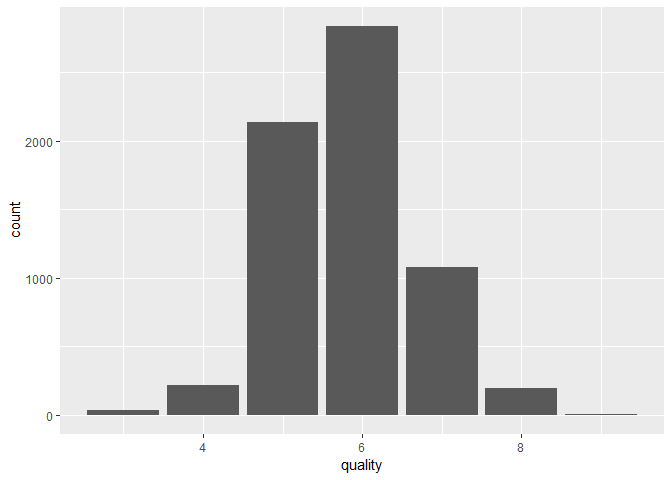

What’s more, by data visualization, it seems that the wines with different qualities have similar chemistry features, making it even more difficult to identify the quality of the wine.

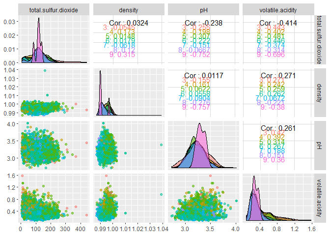

First, by using K-means, we can divide the wines into 7 category. The perfect density graph should be as follow.

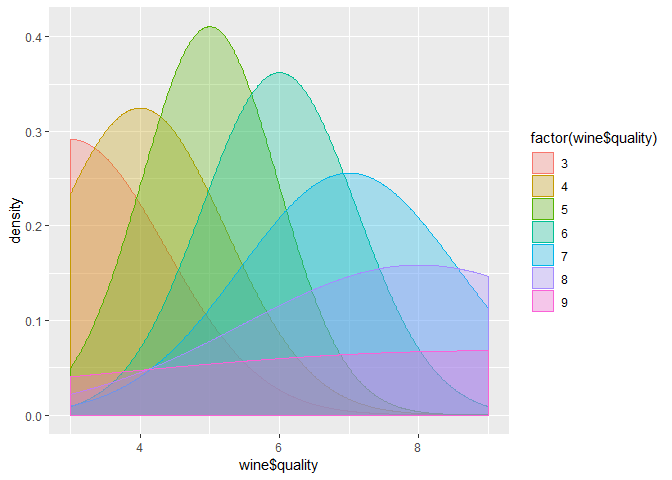

However, the density of different wine should be concentrating on different categories. The result, as is shown in the following density graph and the confusion matrix, is not so good. There is no obvious pattern that could be pointed out from the clustering. Hence the K-mean method fails at this challenge, just as we expected.

    ##               wine$quality
    ## clust2$cluster   3   4   5   6   7   8   9
    ##              1   2  27 267 475 189  31   0
    ##              2   6  63 470 346  43   2   0
    ##              3   5  64 449 549 137  27   1
    ##              4   4  15 197 262 140  14   0
    ##              5   4  21  77 548 446  97   4
    ##              6   2   2  27  16   2   0   0
    ##              7   7  24 651 640 122  22   0

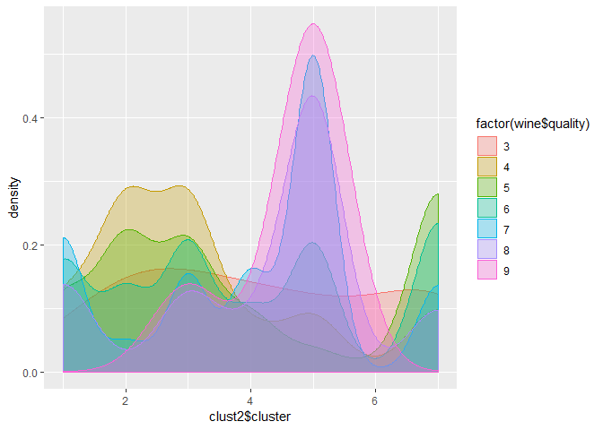

Second, we use the PCA method. Still we choose to use the first four principal components to do the clustering with K=7. The following is the graph of different wines qualities and different categories on the scale of the first two components. From the graph we can hardly tell any relations between the quality of the wine and the categories that we find.

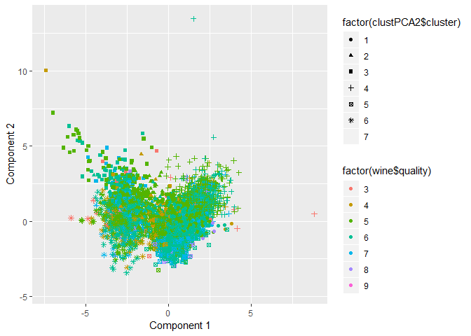

The similar story can be told by looking at the confusion matrix and the density graph. However, the PCA method is slightly better than the K-means, since the high quality wine tends to cluster into similar categories. Saying that, the overall result of the prediction is still a nightmare. The chemistry feature just might not be the reason for the different qualities of the wine.

    ##                  wine$quality
    ## clustPCA2$cluster   3   4   5   6   7   8   9
    ##                 1   0  19 263 248  98   8   0
    ##                 2   4   5  90 121  54   6   0
    ##                 3   5  39 493 603 134  24   1
    ##                 4   7  57 363 274  36   2   0
    ##                 5   5  53 297 565 232  43   0
    ##                 6   7  21 496 485  97  17   0
    ##                 7   2  22 136 540 428  93   4

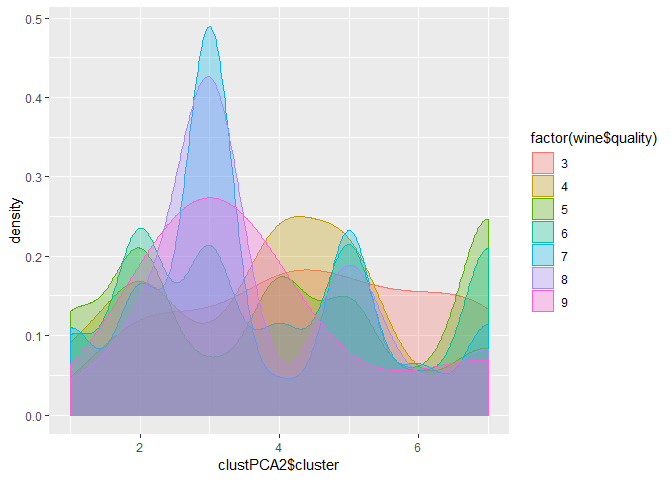

In conclusion, we might not be able to tell the difference among the different quality wine by only looking at the chemical features of the wine.

Exercise 4.2 Market segmentation
--------------------------------

### 4.2.1 Data pre-process

First we decided to eliminate as many bots as possible from the slip through. All users with spam posts are assumed to be pots as only a few dozens of them had spam posts. Users with pornography posts are a bit complicated because more than a few couple hundred users had them and at the same time also posted significant amount of other types of posts, so they might just be actual human users with interests in pornography to some extent . To distinguish between humans and bots, we set an arbitrary rule of 20/80 to delete all users having more than 20% of their total posts in pornagraphy. Next, column chatter and uncategorized are deleted because they are the labels that do not fit at all into any of the interest categories. At the end, we are left with 7,676 users to determine market segmentation using clustering and principal components analysis methodologies. At last, there are 33 variables left.

### 4.2.2 Clustering

In order to determine market segment by k-means clustering, we must first select the number of initial centroids, or in other words, the number of user types. 3 types of supporting analysis were used to help us determine the quantity: Elbow plot(SSE), CH index and Gap statistics.

As shown above, the results are subtle and therefore difficult to determine the best number for K. We eventually picked K=7 for two reasons, 1. we observed a weak signal of dipping in the Gap statistic graph and 2. we found about the equal number of interest groups with relatively strong correlated interests from our correlation analysis as shown below.

We created this heat map hoping to have a deeper analysis of each cluster. Even though we would never know the full picture of each cluster, we believed interests with high proximity, or high correlation, would most likely be fit into same cluster. The more common interests we find from each cluster, the better we can describe each market segment and therefore are able to help our client creating cluster based market strategies.

Some distinct market segments with highly correlated interests are listed below based on the heat map

#### 1. Personal fitness, outdoors, health & nutrition

#### 2. Fashion, cooking, beauty, shopping, photo sharing

#### 3. Online gaming, college&university, sports playing

#### 4. Sports fandom, food, family, religion, parenting, school

#### 5. Politics, news, computers, travel, automobiles

#### 6. TV film, art, music

#### 7. Everything, shopping, photo sharing

From the graphs above, we can see the last group being a very special one, showing moderate interests in almost all areas (compared to strong distinct tastes in other groups). Within the group, interests toward shopping and photo sharing seems to stand out.

### 4.2.3 Principal Components Analysis

After data pre-process, In order to reduce dimension of 33 different categories variables, we decided to use principal components analysis methods to find principal components, which can explain most of the variability in the data.

After center and scale the data, we did the correlation analysis of total 33 categories first. In the correlation matrix above, we found that the correlation of those categories are relatively weak, as most correlation coefficients are below 0.3. Thus, we suppose that the proportion of variance explained by most dominant principal components will not be as high as we expected.

We first got the loadings matrix and scores matrix from principal components methods. Then we calculated proportion of variance explained (PVE) to decide the number of principal components that we need to choose.

    ##  [1] 0.13 0.08 0.08 0.07 0.07 0.05 0.04 0.04 0.03 0.03 0.03 0.03 0.03 0.03
    ## [15] 0.03 0.02 0.02 0.02 0.02 0.01 0.01 0.01 0.01 0.01 0.01 0.01 0.01 0.01
    ## [29] 0.01 0.01 0.01 0.01 0.01

In the above table, we can see that the first eight principal components can explain most of the variability. The first principal component explains 13% of the variability; the second principal component explains 8% of the variability; the third principal component explains 8% of the variability;the fourth principal component explains 7% of the variability; the fifth principal component explains 7% of the variability; the sixth principal component explains 5% of the variability; the seventh principal component explains 4% of the variability; the eighth principal component explains 4% of the variability. Together, the first eight principal components explain 56% of the variability.

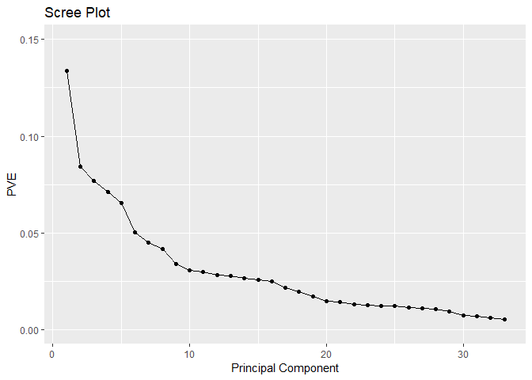

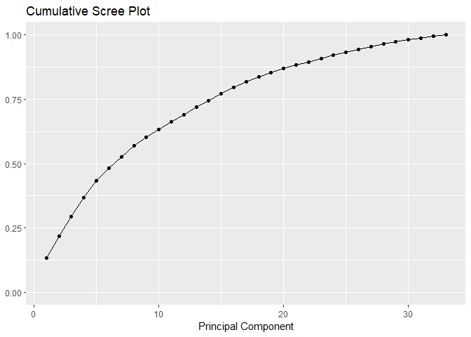

In the PVE Plot, we can see that between eighth and ninth components, there’s a significant gap in the Scree Plot. Also, from the Cumulative PVE Plot, we can find that first eight principal components can explain more than 50% of the total variability. Thus, we choose 8 principal components to divide the market of NutrientH20 into 8 segments. The characteristics of these 8 market segments are actually latent factor inferred from 33 interests categories.

Then we got top 5 interests of followers of NutrientH20 in each market segment.

    ## [1] "religion"      "food"          "parenting"     "sports_fandom"
    ## [5] "school"

    ## [1] "sports_fandom" "religion"      "parenting"     "food"         
    ## [5] "school"

    ## [1] "politics"   "travel"     "computers"  "news"       "automotive"

    ## [1] "health_nutrition" "personal_fitness" "outdoors"        
    ## [4] "politics"         "news"

    ## [1] "beauty"        "fashion"       "cooking"       "photo_sharing"
    ## [5] "shopping"

    ## [1] "online_gaming"  "sports_playing" "college_uni"    "cooking"       
    ## [5] "automotive"

    ## [1] "automotive"     "shopping"       "photo_sharing"  "news"          
    ## [5] "current_events"

    ## [1] "news"       "automotive" "tv_film"    "art"        "beauty"

In the 1st market segment, top 5 interest of followers are "religion", "food", "parenting", "sports\_fandom" and "school".

In the 2nd market segment, top 5 interest of followers are "sports\_fandom", "religion", "parenting", "food" and "school".

In the 1st and 2nd market segment, the top 5 interests are same, so we combine them into one segment as new 1st market segment.

In the 2nd market segment, top 5 interest of followers are "politics", "travel", "computers", "news" and "automotive".

In the 3rd market segment, top 5 interest of followers are "health\_nutrition", "personal\_fitness", "outdoors", "politics" and "news".

In the 4th market segment, top 5 interest of followers are "beauty", "fashion", "cooking", "photo\_sharing" and "shopping".

In the 5th market segment, top 5 interest of followers are "online\_gaming", "sports\_playing", "college\_uni", "cooking" and "automotive".

In the 6th market segment, top 5 interest of followers are "automotive", "shopping", "photo\_sharing", "news" and "current\_events".

In the 7th market segment, top 5 interest of followers are "news", "automotive", "tv\_film", "art" and "beauty".

Finally, we extracted 7 market segments.

### 4.2.4 Conclusion

From the clustering and principal component analysis, we extracted 7 analysis from both of them. The first market segment found by clustering is similar with the third segment found by PCA as they have same interests - Personal fitness, outdoors and health & nutrition.

The second market segment found by clustering is similar with the fourth segment found by PCA as they have same interests - Fashion, cooking, beauty, shopping and photo sharing.

The third market segment found by clustering is similar with the fifth segment found by PCA as they have same interests - Online gaming, college&university and sports playing.

The fourth market segment found by clustering is similar with the first segment found by PCA as they have same interests - Sports fandom, food, religion, parenting and school.

The fifth market segment found by clustering is similar with the second segment found by PCA as they have same interests - Politics, news, computers, travel and automobiles.

The sixth market segment found by clustering is similar with the seventh segment found by PCA as they have similar interests - TV film and art.

The seventh market segment found by clustering is similar with the sixth segment found by PCA as they have similar interests - shopping and photo sharing.

Finally, we labeled above seven market segments to show their unique characteristics.

We named the first market segment as “Mr. fitness”. Those kinds of people focus on working out and keeping in a good shape.

We named the second market segment as “Mrs. fashion”. Those kinds of people like keeping up with fashion and sharing their happy moments with friends.

We named the third market segment as “typical college student”. College students consist with most parts of this group. They are fond of entertainment such as online games and sports during their rest time.

We named the fourth market segment as “middle-age parents”. They care about the fostering of their children. Also, they have interests in sports games.

We named the fifth market segment as “business man”. They pay attention to daily news online. Also, they like travelling during vacation.

We named the sixth market segment as “Hippie”. They like visiting gallery and enjoying movies.

We named the seventh market segment as “Typical online user with interests toward everything but mainly shopping and photo sharing”. This is the typical you and me.

Exercise 4.3 Association rules for grocery purchases
----------------------------------------------------

For the given shopping baskets, first we draw the barplot of the 20 most popular goods among the consumers. From the graph below, the most popular good is whole milk, followed by other vegetables, rolls and buns, soda and yogurt.

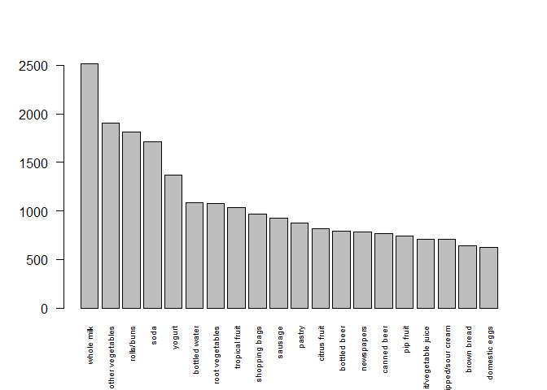

Then we use the criteria that support &gt;= 0.01, confidence &gt;= 0.1, maxlen &lt;= 5 to find all the association rules. The criteria is very ad hoc, but it did help us find 435 rules in total. The following table is the summary of all the association rules.

    ## Apriori
    ## 
    ## Parameter specification:
    ##  confidence minval smax arem  aval originalSupport maxtime support minlen
    ##         0.1    0.1    1 none FALSE            TRUE       5    0.01      1
    ##  maxlen target   ext
    ##       5  rules FALSE
    ## 
    ## Algorithmic control:
    ##  filter tree heap memopt load sort verbose
    ##     0.1 TRUE TRUE  FALSE TRUE    2    TRUE
    ## 
    ## Absolute minimum support count: 98 
    ## 
    ## set item appearances ...[0 item(s)] done [0.00s].
    ## set transactions ...[169 item(s), 9835 transaction(s)] done [0.00s].
    ## sorting and recoding items ... [88 item(s)] done [0.00s].
    ## creating transaction tree ... done [0.00s].
    ## checking subsets of size 1 2 3 4 done [0.00s].
    ## writing ... [435 rule(s)] done [0.00s].
    ## creating S4 object  ... done [0.00s].

    ## set of 435 rules
    ## 
    ## rule length distribution (lhs + rhs):sizes
    ##   1   2   3 
    ##   8 331  96 
    ## 
    ##    Min. 1st Qu.  Median    Mean 3rd Qu.    Max. 
    ##   1.000   2.000   2.000   2.202   2.000   3.000 
    ## 
    ## summary of quality measures:
    ##     support          confidence          lift            count       
    ##  Min.   :0.01007   Min.   :0.1007   Min.   :0.7899   Min.   :  99.0  
    ##  1st Qu.:0.01149   1st Qu.:0.1440   1st Qu.:1.3486   1st Qu.: 113.0  
    ##  Median :0.01454   Median :0.2138   Median :1.6077   Median : 143.0  
    ##  Mean   :0.02051   Mean   :0.2455   Mean   :1.6868   Mean   : 201.7  
    ##  3rd Qu.:0.02115   3rd Qu.:0.3251   3rd Qu.:1.9415   3rd Qu.: 208.0  
    ##  Max.   :0.25552   Max.   :0.5862   Max.   :3.3723   Max.   :2513.0  
    ## 
    ## mining info:
    ##         data ntransactions support confidence
    ##  baskettrans          9835    0.01        0.1

Because there are too many rules, we looked at the subsets of the rules.

First, the following rules have lift&gt;=3, indicating strong connections. There are 8 rules having lift&gt;=3. For example, the first rule shows that if a consumer bought beef, the probability that she also bought root vegetables are three times higher than the prior probability of buying root vegetables. It is highly possible that this type of consumers is buying them to make a beef soup or roasted beef or other beef dishes that includes root vegetables.

    ##     lhs                   rhs                     support confidence     lift count
    ## [1] {beef}             => {root vegetables}    0.01738688  0.3313953 3.040367   171
    ## [2] {root vegetables}  => {beef}               0.01738688  0.1595149 3.040367   171
    ## [3] {whole milk,                                                                   
    ##      yogurt}           => {curd}               0.01006609  0.1796733 3.372304    99
    ## [4] {other vegetables,                                                             
    ##      yogurt}           => {whipped/sour cream} 0.01016777  0.2341920 3.267062   100
    ## [5] {citrus fruit,                                                                 
    ##      root vegetables}  => {other vegetables}   0.01037112  0.5862069 3.029608   102
    ## [6] {citrus fruit,                                                                 
    ##      other vegetables} => {root vegetables}    0.01037112  0.3591549 3.295045   102
    ## [7] {root vegetables,                                                              
    ##      tropical fruit}   => {other vegetables}   0.01230300  0.5845411 3.020999   121
    ## [8] {other vegetables,                                                             
    ##      tropical fruit}   => {root vegetables}    0.01230300  0.3427762 3.144780   121

Second, there are 14 rules having confidence &gt; 0.5. For example, the first rule shows that if a consumer bought curd and yogurt, the probability of buying whole milk is 0.58. It’s highly possible that this type of consumers wants to mix curd, yogurt and whole to make desserts.

    ##      lhs                     rhs                   support confidence     lift count
    ## [1]  {curd,                                                                         
    ##       yogurt}             => {whole milk}       0.01006609  0.5823529 2.279125    99
    ## [2]  {butter,                                                                       
    ##       other vegetables}   => {whole milk}       0.01148958  0.5736041 2.244885   113
    ## [3]  {domestic eggs,                                                                
    ##       other vegetables}   => {whole milk}       0.01230300  0.5525114 2.162336   121
    ## [4]  {whipped/sour cream,                                                           
    ##       yogurt}             => {whole milk}       0.01087951  0.5245098 2.052747   107
    ## [5]  {other vegetables,                                                             
    ##       whipped/sour cream} => {whole milk}       0.01464159  0.5070423 1.984385   144
    ## [6]  {other vegetables,                                                             
    ##       pip fruit}          => {whole milk}       0.01352313  0.5175097 2.025351   133
    ## [7]  {citrus fruit,                                                                 
    ##       root vegetables}    => {other vegetables} 0.01037112  0.5862069 3.029608   102
    ## [8]  {root vegetables,                                                              
    ##       tropical fruit}     => {other vegetables} 0.01230300  0.5845411 3.020999   121
    ## [9]  {root vegetables,                                                              
    ##       tropical fruit}     => {whole milk}       0.01199797  0.5700483 2.230969   118
    ## [10] {tropical fruit,                                                               
    ##       yogurt}             => {whole milk}       0.01514997  0.5173611 2.024770   149
    ## [11] {root vegetables,                                                              
    ##       yogurt}             => {whole milk}       0.01453991  0.5629921 2.203354   143
    ## [12] {rolls/buns,                                                                   
    ##       root vegetables}    => {other vegetables} 0.01220132  0.5020921 2.594890   120
    ## [13] {rolls/buns,                                                                   
    ##       root vegetables}    => {whole milk}       0.01270971  0.5230126 2.046888   125
    ## [14] {other vegetables,                                                             
    ##       yogurt}             => {whole milk}       0.02226741  0.5128806 2.007235   219

Third, as the thresholds we set above are too strict that once we combine them there would be too little associations, we purposely relaxed the constraints. After contemplating the significance of the associations and the overall visualization, we set lift&gt;2 & confidence&gt;0.3, resulting 44 rules. For example, the first rule shows that if a consumer bought onions, the probability that he also bought other vegetables are 2.3 times higher than the prior probability of buying other vegetables. With the same rule, if he bought onions, the probability of buying other vegetables is 0.46. It’s highly possible that this type of consumers wants to use onions and other vegetables to make salad.

    ##      lhs                        rhs                   support confidence     lift count
    ## [1]  {onions}                => {other vegetables} 0.01423488  0.4590164 2.372268   140
    ## [2]  {berries}               => {yogurt}           0.01057448  0.3180428 2.279848   104
    ## [3]  {hamburger meat}        => {other vegetables} 0.01382816  0.4159021 2.149447   136
    ## [4]  {cream cheese }         => {yogurt}           0.01240468  0.3128205 2.242412   122
    ## [5]  {chicken}               => {other vegetables} 0.01789527  0.4170616 2.155439   176
    ## [6]  {beef}                  => {root vegetables}  0.01738688  0.3313953 3.040367   171
    ## [7]  {curd}                  => {yogurt}           0.01728521  0.3244275 2.325615   170
    ## [8]  {whipped/sour cream}    => {other vegetables} 0.02887646  0.4028369 2.081924   284
    ## [9]  {root vegetables}       => {other vegetables} 0.04738180  0.4347015 2.246605   466
    ## [10] {curd,                                                                            
    ##       yogurt}                => {whole milk}       0.01006609  0.5823529 2.279125    99
    ## [11] {curd,                                                                            
    ##       whole milk}            => {yogurt}           0.01006609  0.3852140 2.761356    99
    ## [12] {pork,                                                                            
    ##       whole milk}            => {other vegetables} 0.01016777  0.4587156 2.370714   100
    ## [13] {butter,                                                                          
    ##       other vegetables}      => {whole milk}       0.01148958  0.5736041 2.244885   113
    ## [14] {butter,                                                                          
    ##       whole milk}            => {other vegetables} 0.01148958  0.4169742 2.154987   113
    ## [15] {domestic eggs,                                                                   
    ##       other vegetables}      => {whole milk}       0.01230300  0.5525114 2.162336   121
    ## [16] {domestic eggs,                                                                   
    ##       whole milk}            => {other vegetables} 0.01230300  0.4101695 2.119820   121
    ## [17] {fruit/vegetable juice,                                                           
    ##       whole milk}            => {other vegetables} 0.01047280  0.3931298 2.031756   103
    ## [18] {whipped/sour cream,                                                              
    ##       yogurt}                => {other vegetables} 0.01016777  0.4901961 2.533410   100
    ## [19] {other vegetables,                                                                
    ##       whipped/sour cream}    => {yogurt}           0.01016777  0.3521127 2.524073   100
    ## [20] {whipped/sour cream,                                                              
    ##       yogurt}                => {whole milk}       0.01087951  0.5245098 2.052747   107
    ## [21] {whipped/sour cream,                                                              
    ##       whole milk}            => {yogurt}           0.01087951  0.3375394 2.419607   107
    ## [22] {whipped/sour cream,                                                              
    ##       whole milk}            => {other vegetables} 0.01464159  0.4542587 2.347679   144
    ## [23] {other vegetables,                                                                
    ##       pip fruit}             => {whole milk}       0.01352313  0.5175097 2.025351   133
    ## [24] {pip fruit,                                                                       
    ##       whole milk}            => {other vegetables} 0.01352313  0.4493243 2.322178   133
    ## [25] {citrus fruit,                                                                    
    ##       root vegetables}       => {other vegetables} 0.01037112  0.5862069 3.029608   102
    ## [26] {citrus fruit,                                                                    
    ##       other vegetables}      => {root vegetables}  0.01037112  0.3591549 3.295045   102
    ## [27] {citrus fruit,                                                                    
    ##       whole milk}            => {yogurt}           0.01026945  0.3366667 2.413350   101
    ## [28] {citrus fruit,                                                                    
    ##       whole milk}            => {other vegetables} 0.01301474  0.4266667 2.205080   128
    ## [29] {root vegetables,                                                                 
    ##       tropical fruit}        => {other vegetables} 0.01230300  0.5845411 3.020999   121
    ## [30] {other vegetables,                                                                
    ##       tropical fruit}        => {root vegetables}  0.01230300  0.3427762 3.144780   121
    ## [31] {root vegetables,                                                                 
    ##       tropical fruit}        => {whole milk}       0.01199797  0.5700483 2.230969   118
    ## [32] {tropical fruit,                                                                  
    ##       yogurt}                => {other vegetables} 0.01230300  0.4201389 2.171343   121
    ## [33] {other vegetables,                                                                
    ##       tropical fruit}        => {yogurt}           0.01230300  0.3427762 2.457146   121
    ## [34] {tropical fruit,                                                                  
    ##       yogurt}                => {whole milk}       0.01514997  0.5173611 2.024770   149
    ## [35] {tropical fruit,                                                                  
    ##       whole milk}            => {yogurt}           0.01514997  0.3581731 2.567516   149
    ## [36] {tropical fruit,                                                                  
    ##       whole milk}            => {other vegetables} 0.01708185  0.4038462 2.087140   168
    ## [37] {root vegetables,                                                                 
    ##       yogurt}                => {other vegetables} 0.01291307  0.5000000 2.584078   127
    ## [38] {root vegetables,                                                                 
    ##       yogurt}                => {whole milk}       0.01453991  0.5629921 2.203354   143
    ## [39] {rolls/buns,                                                                      
    ##       root vegetables}       => {other vegetables} 0.01220132  0.5020921 2.594890   120
    ## [40] {rolls/buns,                                                                      
    ##       root vegetables}       => {whole milk}       0.01270971  0.5230126 2.046888   125
    ## [41] {root vegetables,                                                                 
    ##       whole milk}            => {other vegetables} 0.02318251  0.4740125 2.449770   228
    ## [42] {other vegetables,                                                                
    ##       whole milk}            => {root vegetables}  0.02318251  0.3097826 2.842082   228
    ## [43] {other vegetables,                                                                
    ##       yogurt}                => {whole milk}       0.02226741  0.5128806 2.007235   219
    ## [44] {whole milk,                                                                      
    ##       yogurt}                => {other vegetables} 0.02226741  0.3974592 2.054131   219

The following is the scatter plot of all the rules.

    ## To reduce overplotting, jitter is added! Use jitter = 0 to prevent jitter.

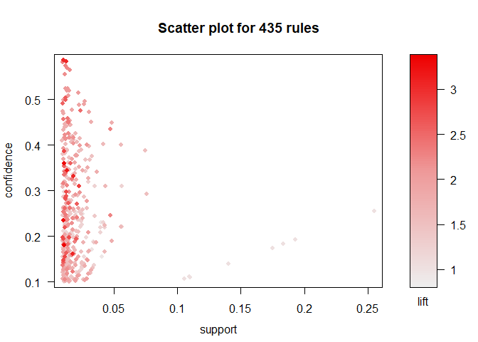

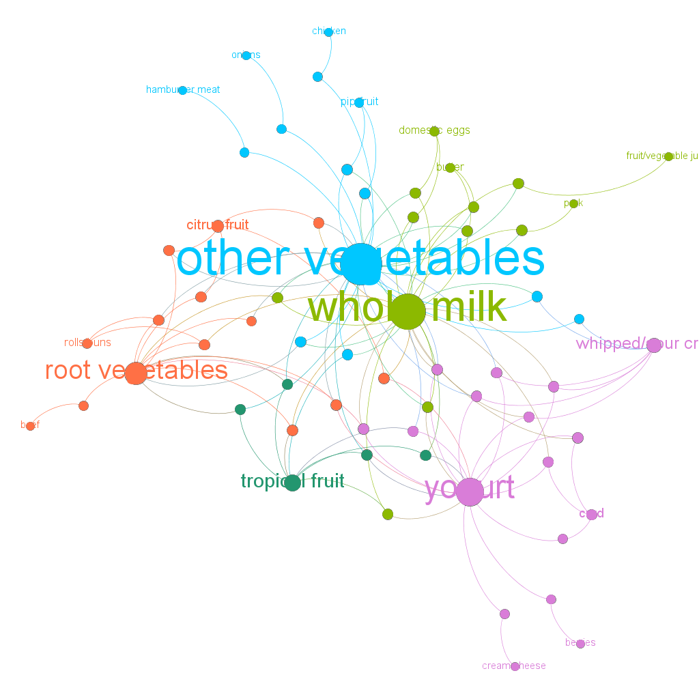

After this, we use the data and gephi to draw a network graph of the connections. In the following graph, the nodes with larger size have higher degree. In conclusion, other vegetables has the highest degree.
